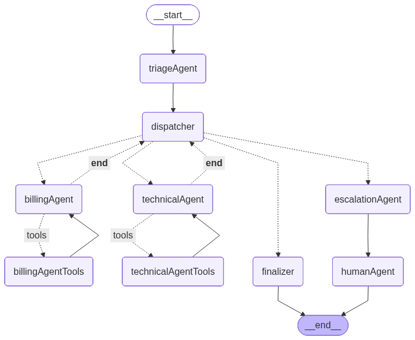

CloudDash Customer Support Bot
==============================

    

Overview
--------
CloudDash is a multi-agent customer support service built on FastAPI, LangGraph, and Gemini models. It triages user requests, routes them to specialized agents (billing, technical, escalation), retrieves knowledge base context from ChromaDB, and streams the final response back to the client.

Key Features
------------
- Multi-agent orchestration with LangGraph
- Triage and routing by intent (billing, technical, escalation)
- Knowledge base retrieval tool backed by ChromaDB
- Streaming NDJSON responses for responsive UI updates
- Input/output guardrails (prompt-injection detection, PII redaction)
- Structured handover logging for audit and analytics

Agent Flow
----------


Architecture
------------
The system is a LangGraph workflow assembled at runtime from config/agents.yaml. A single request moves through these stages:

1. API + Orchestrator: The FastAPI endpoint creates a thread_id, loads the Chroma collection, and constructs the LangGraph state machine with tool nodes and routing rules.
2. Triage Agent: Parses the user message into structured tasks, each with intent, priority context, and entities.
3. Dispatcher: Reads the pending task list and routes to the correct specialist by intent (billing, technical, escalation), with a safe fallback when intent is unknown.
4. Specialist Agents:
	- Billing Agent: Handles billing tasks and can call the knowledge base retriever.
	- Technical Agent: Handles technical tasks and can call the knowledge base retriever.
5. Escalation Path: Escalation Agent packages context for a human; Human Agent generates a human-style response for escalated issues.
6. Finalizer: Aggregates outputs from specialist agents into a single response when no human handoff is required.

Operational Notes
- Tool calls are executed via LangGraph ToolNode; tool responses re-enter the same agent for completion.
- Handovers between agents are logged for audit and analytics.
- Responses stream back as NDJSON events so clients can render partial output.
- Guardrails are enforced at the API boundary (prompt-injection detection) and on streamed responses (PII redaction).

Architecture Overview
---------------------
- The FastAPI endpoint initializes a thread ID, then runs a LangGraph workflow per request.
- The workflow graph is assembled at runtime from config/agents.yaml, including tools and routing.
- Triage produces structured tasks; the dispatcher routes each pending task by intent with a fallback.
- Billing and technical agents can call the knowledge base retriever; tool outputs re-enter the same agent.
- Escalation flows through the escalation agent to a human-style response when needed.
- The finalizer aggregates specialist outputs when a human handoff is not required.
- Handover events are logged with a state snapshot for audit and analytics.

Configuration
-------------
- Agent models, prompts, tools, and routing are defined in config/agents.yaml.
- System prompts live in config/prompts/.
- Agent state schema is defined in config/schema.py.

Design Decisions
----------------
- Configuration-driven orchestration so agents, prompts, tools, and routing can change without code edits.
- Structured outputs for triage and escalation to keep state deterministic.
- A tool registry and ToolNode usage to keep tools decoupled from agent logic.
- Streaming NDJSON responses to improve client responsiveness.
- Handover logging to capture transitions and context snapshots.

Project Structure
-----------------
```
CloudDash/
├── .venv
├── main.py
├── README.md
├── requirements.txt
├── agents/
├── api/
├── config/
├── knowledge_base/
├── logger/
├── retrieval/
└── tests/
```

Setup Instructions
------------------
1. Create and activate a virtual environment.
2. Install dependencies (see Installation below).
3. Set environment variables (see Environment Variables below).
4. Run the API (see Running the API below).

Installation
------------
1. Create and activate a virtual environment.
2. Install dependencies.

Windows (PowerShell):
```
python -m venv .venv
.\.venv\Scripts\Activate.ps1
pip install -r requirements.txt
```

macOS/Linux:
```
python -m venv .venv
source .venv/bin/activate
pip install -r requirements.txt
```

Environment Variables
---------------------
Set these before running the API:

- GEMINI_API_KEY or GOOGLE_API_KEY: required for Gemini embeddings and chat models.
- CORS_ORIGINS: optional, comma-separated list of allowed origins (defaults to *).
- HANDOVER_LOG_PATH: optional custom path for handover logs.

For Using Langsmith Observability Tool:
- LANGSMITH_TRACING="true"
- LANGCHAIN_ENDPOINT="https://api.smith.langchain.com"
- LANGCHAIN_API_KEY="lsv2_***************************"
- LANGCHAIN_PROJECT="CloudDash"

Running the API
---------------
```
uvicorn main:app
```

API Usage
---------
POST /agent

Request body:
```
{
	"message": "My billing invoice looks wrong.",
	"thread_id": "optional-existing-thread-id"
}
```

Response:
- Streaming NDJSON with events like `thread_id` and `message`.

Notes
-----
- The knowledge base is loaded from knowledge_base/knowledge_base.json at startup.
- Each request reuses the configured Chroma collection and embeds documents with Gemini embeddings.

Known Limitations
-----------------
- Chroma uses an in-memory client by default; persistence is not configured.
- The embedding task type from config is not applied due to a key mismatch.
- Conversation memory uses in-process checkpointing and does not survive restarts.
- The API endpoint has no authentication or rate limiting.
- Knowledge base retrieval returns a fixed top-3 results with no reranking or pagination.

Testing
-------
```
pytest
```


